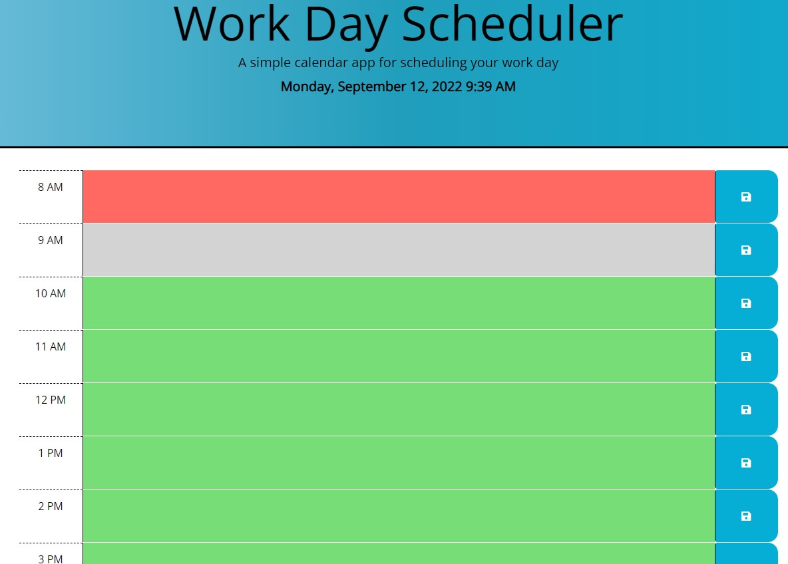
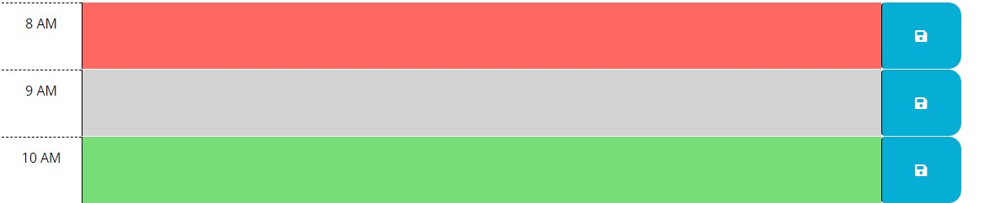
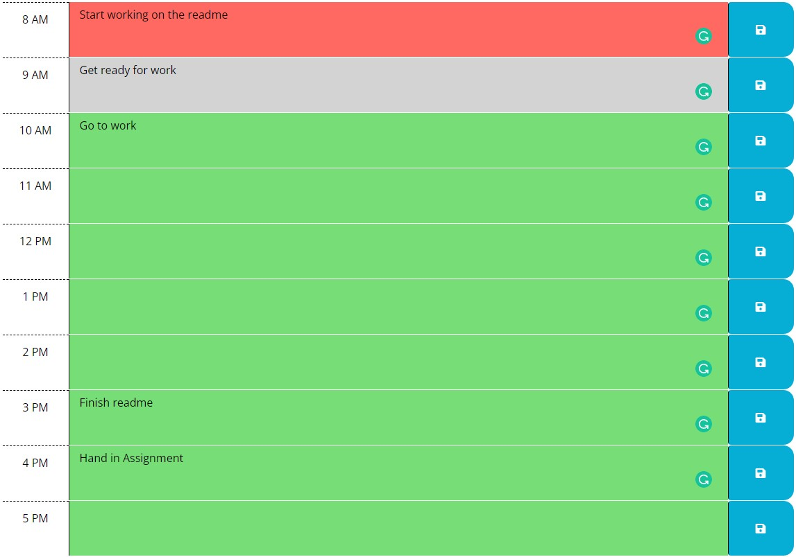

# Work Day Scheduler

## Description

This is a little handy app for your Workday schedule. You can save your schedule on here
I learnt how to use Javascript and the use of Third-party functionality in a website.

## Table of Contents

- [Installation](#installation)
- [Usage](#usage)
- [Credits](#credits)
- [License](#license)

## Installation

The Application has been deployed to the following website:

- https://breakfireaus.github.io/work-day-scheduler/

To start the application just visit the website

## Usage

- Main Page

- Passage of time
    - Red = Past
    - Grey = Present
    - Green = Future

- Save Button - so the user may save the calender in local storage and when they refresh the page it will be persistant

- Screenshot of filled out Calender which is saved

## Credits

- Ask BCS team @ Monash university Bootcamp
- Tutor for getting me on track
- https://www.w3schools.com/jsref/met_node_appendchild.asp
- https://www.w3schools.com/jsref/met_element_addeventlistener.asp
- https://www.w3schools.com/jsref/met_document_createattribute.asp
- https://www.w3schools.com/jsref/met_document_createelement.asp
- https://www.w3schools.com/jsref/met_document_getelementbyid.asp
- https://www.w3schools.com/js/js_json_parse.asp
- https://www.w3schools.com/js/js_api_web_storage.asp
- https://www.w3schools.com/js/js_htmldom_methods.asp
- Bootstrap v4.3.1 (https://getbootstrap.com/docs/4.3/getting-started/introduction/)
- Font Awesome Free 5.8.1 by @fontawesome - https://fontawesome.com
- https://momentjs.com/
- https://jquery.com/

## License

MIT License

Copyright (c) 2022 breakfireaus

Permission is hereby granted, free of charge, to any person obtaining a copy
of this software and associated documentation files (the "Software"), to deal
in the Software without restriction, including without limitation the rights
to use, copy, modify, merge, publish, distribute, sublicense, and/or sell
copies of the Software, and to permit persons to whom the Software is
furnished to do so, subject to the following conditions:

The above copyright notice and this permission notice shall be included in all
copies or substantial portions of the Software.

THE SOFTWARE IS PROVIDED "AS IS", WITHOUT WARRANTY OF ANY KIND, EXPRESS OR
IMPLIED, INCLUDING BUT NOT LIMITED TO THE WARRANTIES OF MERCHANTABILITY,
FITNESS FOR A PARTICULAR PURPOSE AND NONINFRINGEMENT. IN NO EVENT SHALL THE
AUTHORS OR COPYRIGHT HOLDERS BE LIABLE FOR ANY CLAIM, DAMAGES OR OTHER
LIABILITY, WHETHER IN AN ACTION OF CONTRACT, TORT OR OTHERWISE, ARISING FROM,
OUT OF OR IN CONNECTION WITH THE SOFTWARE OR THE USE OR OTHER DEALINGS IN THE
SOFTWARE.

